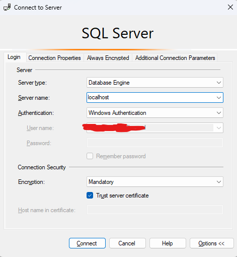

# Projeto E-commerce para ONGs

<!--  -->

## 📋 Visão Geral

Este projeto é um sistema de e-commerce desenvolvido para Organizações Não-Governamentais (ONGs) utilizando ASP.NET Core e Entity Framework Core. Ele permite que organizações gerenciem produtos, clientes e pedidos de forma eficiente.

## 🚀 Começando

### Pré-requisitos

- [.NET 9.0.4 SDK](https://dotnet.microsoft.com/download/dotnet/9.0)
- [SQL Server](https://www.microsoft.com/pt-br/evalcenter/download-sql-server-2022)
- [SQL Server Management Studio](https://learn.microsoft.com/en-us/ssms/download-sql-server-management-studio-ssms)

### Ferramentas e Pacotes Necessários

Instale as seguintes ferramentas e pacotes:

```bash
# Instalar as ferramentas CLI do Entity Framework
dotnet tool install --global dotnet-ef

# Adicionar pacote do SqlServer
dotnet add package Microsoft.EntityFrameworkCore.SqlServer
```

## 🔧 Configuração Inicial

Após baixar todas as dependências:

1. Abra o SQL Server Management Studio

2. Conecte-se com as seguintes configurações:
<br>



1. Crie a migração inicial do banco de dados:
   ```bash
   dotnet ef migrations add v1
   ```

2. Aplique a migração para criar o banco de dados:
   ```bash
   dotnet ef database update
   ```

3. Execute a aplicação:
   ```bash
   dotnet run
   ```

## 📊 Gerenciamento do Banco de Dados

### Criando uma Nova Migração

Quando você fizer alterações nos models, crie uma nova migração:

```bash
dotnet ef migrations add [NomeDaMigração]
```

Exemplo:
```bash
dotnet ef migrations add AdicionarCategoriaProduto
```

### Remover a Última Migração

Se você precisar desfazer uma migração que ainda não foi aplicada:

```bash
dotnet ef migrations remove
```

### Gerar Script SQL das Migrações

Para visualizar o SQL que seria executado:

```bash
dotnet ef migrations script > script.sql
```

### Aplicar Migrações ao Banco de Dados

Para atualizar o banco de dados com as migrações pendentes:

```bash
dotnet ef database update
```

Para especificar uma string de conexão:
```bash
dotnet ef database update --connection "Data Source=Meu.db"
```

## 🧪 Ferramentas de Desenvolvimento

Para iniciar o servidor de desenvolvimento com recarga automática:

```bash
dotnet watch run
```

## 📁 Estrutura do Projeto

- `Controllers/`: Controladores API para lidar com requisições
- `Models/`: Modelos de dados (Cliente, Pedido, ItemPedido, Produto)
- `Data/`: Contexto do banco de dados e configuração
- `Migrations/`: Arquivos de migração do banco de dados
- `Views/`: (Se estiver usando MVC) Templates de visualização
- `wwwroot/`: Arquivos estáticos (CSS, JavaScript, imagens)

## 👥 Colaboradores

- Professor Dr. Henrique Dezani
- Fatec Rio Preto

- Guilherme Saud Favaro
- Isaque Precioso de Andrade